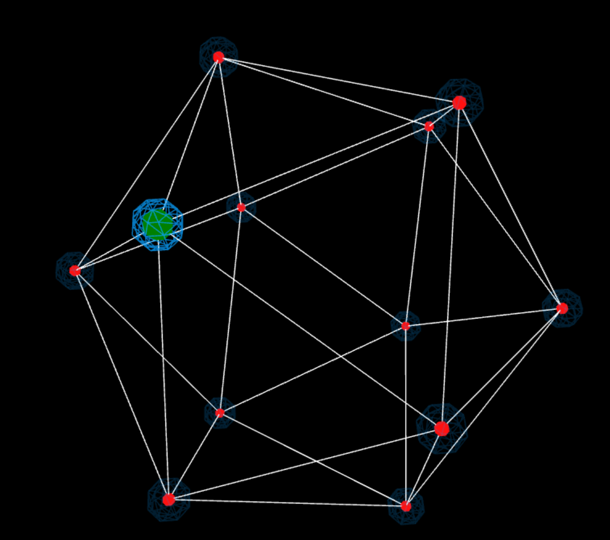

Visualizing network packet data using three.js,
The name of the company is Cybvernetiq, which (as interpreted by this developer) is a portmanteau of the words Skynet and Cyberdyne. In that spirit this little project is called "The Resistance", because as cyber security analysts we are the good guys!

## Run project
### run server
node server.js
follow the url provided in the command prompt or follow this -> [link here](http://localhost:9000/index.html)

Alternatively, open the html file in browser - packet_visuals.html
Refresh the page to start it again. 
---
## Sample Data Packet

```javascript
  {
    "No.": 1,
    Time: 0,
    Source: "192.168.2.101",
    Destination: "211.137.137.11",
    Protocol: "TCP",
    Length: 76
  };
```
---
## Work done so far
1. Selected visualization technique using the IcosahedronGeometry geometry. 
* Node status interpretation.
```
 Flourescent color is for when the node is transmitting 
 The default color depicts a node which is in it's resting state and possibly recieving packets. This is done because as there are only two active nodes there is no need to highlight or emphasize any nodes recieving packets.
 ```


* The color of the cell, which is the dot, determines the protocol being used.
```
 Green is for TCP
 Yellow is for CCMP
```
2. Select metric or variable to tie to json data 
* Circle mesh color of virtices. Inner "cell" mesh and the outer "wireframe" mesh
3. Analyze data using D3 to view the data using graphs
```javascript
      //Group the data by source
      let dataBySource = d3
        .nest()
        .key(function(d) {
          return d.Source;
        })
        .entries(data);
      console.log(dataBySource);
 ```
4. Synchronize internal clock with packet Time variable (in progress).
* Select time within a certain window
* The issue here is that the packet data arrives faster than the browsers internal clock is able to keep up with. That is for every tic of the browsers clock more than one packet would have arrived.
* Could be just how javascript handles floating point numbers. A possible solution would be to convert it all to integers and deal with each time interval separately and designate a sing;e tic of the clock to the smallest difference within the data. Make is pseudo-real-time!
5. TODO: Animate connected lines in ```update()``` loop.

---
### Hours put in
* Monday 18th March - 4 hrs.
* Tuesday 18th March - 30 minutes
* Monday morning 25 March - 2 hours or so
